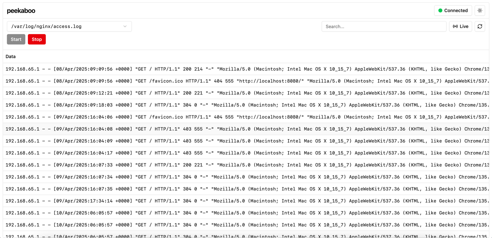

# logscope

A full stack web application for viewing nginx logs in real time. 


> Note: This is heavily work in progress, and this is a preview of v1.3.0

> [!CAUTION]
> logscope is still heavy in development, expect breaking changes often.

## ⏳ Activity


## ♻️ Release Cycle

logscope follows the [Semantic Versioning](https://semver.org/) guidelines.

## ✨ Installation and Configuration

### Installation for Development

1. clone the repository:

```bash
git clone https://github.com/Dino-Kupinic/logscope.git
```

2. install packages

```bash
bun i
```

> [!TIP]
> If you don't have bun installed, checkout https://bun.sh/ to install for your operating system.

3. configure `.env`

// WIP

## 🚀 Deployment

1. build the app

```bash
bun run build
```

// WIP

## 😄 Author

- [@Dino Kupinic](https://www.github.com/Dino-Kupinic)

## 🛠️ Tech Stack

- React
- Bun

## 🙏 Contributing

Contributions are always welcome! 
Feel free to create an issue or submit a pull request. :)

Please follow coding standards and commit message conventions.

## 😊 License

[MIT](https://choosealicense.com/licenses/mit/)
